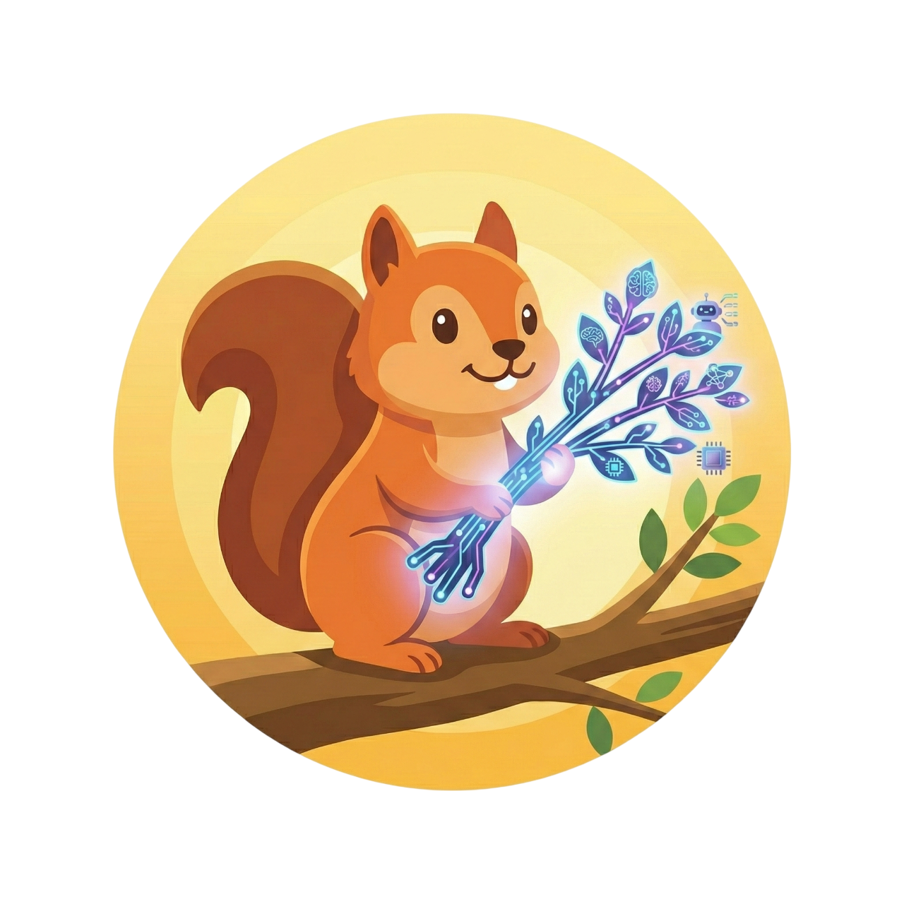

<p align="center">
  
</p>

<h1 align="center">Santree</h1>

<p align="center">
  <strong>A beautiful CLI for managing Git worktrees</strong>
</p>

<p align="center">
  <a href="https://www.npmjs.com/package/santree"></a>
  <a href="https://www.npmjs.com/package/santree"></a>
  <a href="https://github.com/santiagotoscanini/santree/blob/main/LICENSE"></a>
</p>

<p align="center">
  Pick an issue, work on it with Claude in an isolated worktree, ship a PR — without leaving your terminal.<br/>
  Pluggable issue trackers (Linear, GitHub Issues), pluggable multiplexers (tmux, cmux), and AI in the loop.
</p>

<p align="center">
  <strong>📚 <a href="https://santiagotoscanini.github.io/santree/">Read the docs</a></strong>
</p>

---

<!-- TODO screenshot: dashboard hero shot — Issues tab with a few projects, at least one issue expanded into · diff / · pr / · session sub-rows, right pane showing the description + git status + actions footer. Wide aspect ratio (terminal at ~140 cols). -->

## Install

```bash
npm install -g santree
eval "$(santree helpers shell-init zsh)"   # or bash
santree doctor
```

Full setup: [Installation](https://santiagotoscanini.github.io/santree/installation.html).

<!-- TODO screenshot: diff overlay (`v` key) with delta enabled — file tree on the left, syntax-highlighted diff on the right. Pick a colorful change (TS file with type changes works well). -->

<!-- TODO screenshot (optional): a tmux window split — dashboard on one pane, a Claude `worktree work` session running in another. Shows the "AI in the loop" story visually. -->

## Where to next

- **[Quickstart](https://santiagotoscanini.github.io/santree/quickstart.html)** — 5-minute end-to-end walkthrough
- **[Concepts](https://santiagotoscanini.github.io/santree/concepts.html)** — the mental model (worktrees, trackers, multiplexers, AI)
- **[Dashboard](https://santiagotoscanini.github.io/santree/dashboard.html)** — the TUI tour
- **[Commands](https://santiagotoscanini.github.io/santree/commands.html)** — full CLI reference

Everything else — configuration, integrations, contributing — is in the **[docs site](https://santiagotoscanini.github.io/santree/)**.

## License

MIT
