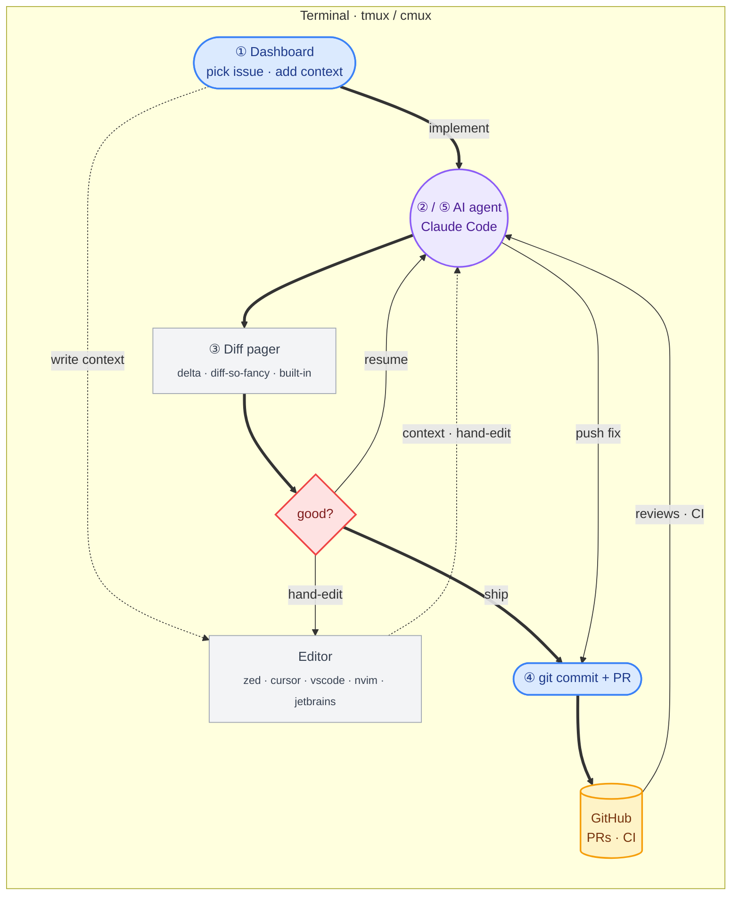

# Workflow
{: .no_toc }

End-to-end flow, from picking an issue to merging the PR. Everything runs inside the terminal multiplexer; the dashboard orchestrates and the AI agent does the heavy lifting at two distinct stages.

1. TOC
{:toc}

---

## Diagram

Bold edges (`==>`) follow the happy path; thin edges (`-->`) are branches/loops; dotted edges (`-.->`) are optional editor side-trips. Colors group nodes by role: blue actions, purple agent, gray tools, yellow external service, red decision.

---

## Stages

1. **Pick + add context** — open the dashboard, browse assigned issues, pick one. The inline context box lets you add custom instructions to the prompt; `Ctrl+O` drops into your editor for longer prose.
2. **AI agent (Claude)** — runs in the worktree's mux window with the rendered ticket + your context. Implements or plans.
3. **Diff pager (review)** — `[v]` opens the diff overlay. From here you iterate: hand-edit in your editor, or resume the Claude session to keep going.
4. **Ship** — once the diff looks right, `[C]` for inline commit + push, then `[c]` to create the PR (`--fill` runs Claude non-interactively against the PR template).
5. **PR feedback loop** — `[f]` (fix) and `[r]` (self-review) re-launch the AI with PR comments + CI failures as input. Patches are pushed; CI re-runs; loop until merged.

---

## Supported tools per stage

| Stage | Supported today | Planned |
|---|---|---|
| **Issue tracker** (① Dashboard) | Linear, GitHub Issues, Local (built-in file-based) | Jira, Shortcut, etc. |
| **AI agent** (②, ⑤) | Claude Code (`claude` CLI) | OpenAI Codex, OpenCode, Cursor agent |
| **Diff pager** (③) | delta, diff-so-fancy, any unified-diff pager — built-in colorizer when none set | — |
| **Editor** (side branch) | Anything taking a path: zed, nvim, jetbrains, cursor, vscode. cursor + vscode also handle `.code-workspace` files via `[E]` workspace shortcut | — |
| **Forge** (④) | GitHub via `gh` CLI | GitLab, Bitbucket, Gitea |
| **Terminal multiplexer** (outer frame) | tmux, cmux *(macOS-only — see [#1472](https://github.com/manaflow-ai/cmux/issues/1472))*, none | zellij |

The AI agent and issue tracker are already behind interfaces (`lib/trackers/`, plus the `claude` CLI shim in `lib/ai.ts`). Adding a new option in either category means writing one new module and wiring it into the factory — no changes to UI/dashboard code.
